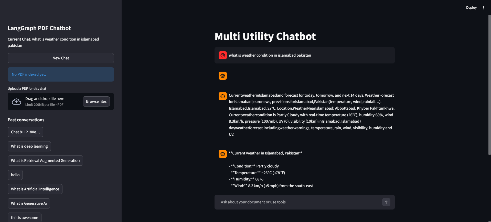

# AI Assistant for Teams — Multi-Utility Chatbot
 
**Problem:** Teams waste time switching between tools — searching documents, checking live data, doing quick calculations, and re-explaining context they've already given before.
 
**Solution:** A single AI chat interface that handles document Q&A, web search, live stock lookups, and calculations — with full conversation memory, so nothing has to be repeated.
 
**Result:** One chat window replaces several browser tabs. Conversations are saved and can be resumed anytime, and each chat auto-names itself from the first message so past conversations are easy to find again.
 
🔗 **Live Demo:** https://langgraph-multi-utility-chatbot.streamlit.app/



---
 
## What It Does
 
- **Ask questions and get answers from your own documents** — upload a PDF and query it directly, no manual digging
- **Get real-time information** — pulls from the web and checks live stock prices when needed
- **Do quick math without leaving the chat**
- **Never lose context** — full conversation memory across sessions
- **Find old conversations fast** — chats are automatically named and stored persistently
## Tech Stack
 
| Layer | Tool |
|---|---|
| LLM | Groq (LLaMA / GPT-OSS) |
| Embeddings | OpenAI `text-embedding-3-small` |
| Orchestration | LangGraph |
| Memory / Checkpointing | SQLite |
| Vector Store | FAISS |
| UI | Streamlit |
 
## Try It Yourself
 
1. Open the [live demo](#) above
2. Type a message to start chatting — your first message becomes the chat's name
3. To ask about a PDF, upload it from the sidebar first
4. Click **New Chat** anytime to start fresh with a clean slate
## About This Project
 
Built as a demonstration of production-style AI agent architecture — tool-calling, retrieval-augmented generation, persistent memory, and multi-turn state management — for teams looking to add a custom AI assistant to their internal workflows. Happy to build a version of this tailored to your specific documents, tools, or workflow.
 
---
 
## Run It Locally
 
**1. Clone the repo and create a virtual environment**
```bash
git clone https://github.com/asifongit/LangGraph-Multi-Utility-Chatbot.git
python -m venv venv
venv\Scripts\activate        # Windows
```
 
**2. Install dependencies**
```bash
pip install -r requirements.txt
```
 
**3. Add your API keys** — update the `.env` file:
```
GROQ_API_KEY=your_groq_key
OPENAI_API_KEY=your_openai_key
```
 
**4. Run the app**
```bash
streamlit run langgraph_frontend.py
```

